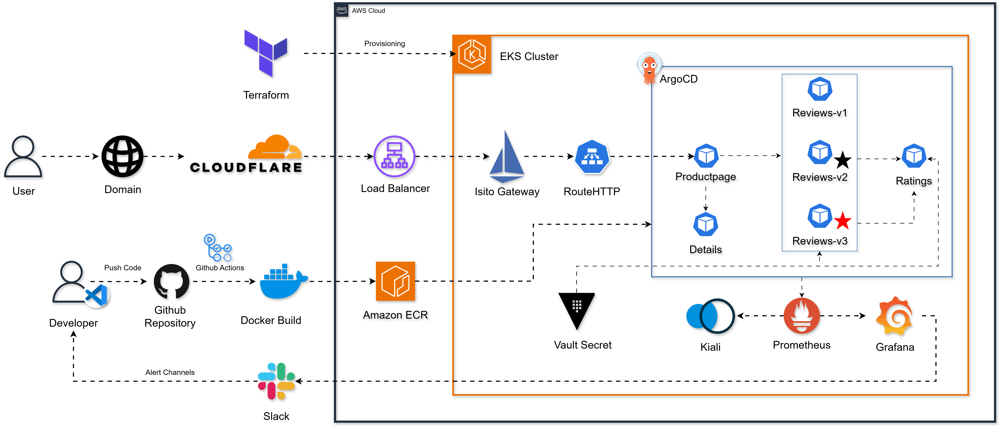

# DevOps on AWS & AI — Step-by-Step Lab

## [Udemy Course](https://www.udemy.com/course/devops-on-aws-real-project-all-in-one/?referralCode=3F783CCB917A27EBB1E1)

Start with [START_HERE.md](START_HERE.md). Each lesson explains what to change, why it matters, which command to run, and what you should see next.

| Lesson | Result |
|---|---|
| [1. Prepare your workstation](docs/01-getting-started.md) | Open the project and prepare your tools |
| [2. Run Bookinfo with Docker](docs/02-local-containers.md) | Build and test the application locally |
| [3. Create AWS infrastructure](docs/03-infrastructure.md) | Provision state storage, a VPC, EKS and ECR |
| [4. Deploy Bookinfo to EKS](docs/04-deployment.md) | Publish images and run the application |
| [5. Add a domain and HTTPS](docs/05-networking.md) | Route public traffic through a Gateway |
| [6. Automate delivery](docs/06-delivery.md) | Build with GitHub Actions and deploy with Argo CD |
| [7. Monitor and scale](docs/07-operations.md) | Observe metrics, alerts and replica changes |
| [8. Investigate an incident](docs/08-incident.md) | Break the lab application and recover through Git |
| [9. Run the AI investigator](docs/09-ai-agent.md) | Give Bedrock read-only investigation tools |
| [10. Add runbook knowledge](docs/10-rag-agentcore.md) | Use local runbooks or a Bedrock Knowledge Base |
| [11. Approve AI-assisted recovery](docs/11-ai-recovery.md) | Review a proposal, recover and verify |
| [12. Build a portfolio and clean up](docs/12-portfolio-cleanup.md) | Save evidence and remove lab resources |

Optional labs: [Databases](docs/labs/databases.md), [Vault](docs/labs/vault.md), [AgentCore on AWS](docs/labs/agentcore-cloud.md).

References: [Architecture](docs/architecture.md), [Troubleshooting](docs/TROUBLESHOOTING.md), [Official documentation](docs/SOURCES.md).

Use one `develop` environment. Follow the examples on Ubuntu 24.04 x86_64 or Ubuntu in WSL2. Cloud resources incur charges; read the cleanup lesson before provisioning them.

The `instructor/` folder contains owner-only notes. The `legacy/` folder is an archive and is not part of these exercises. Source attribution is in [NOTICE.md](NOTICE.md).
