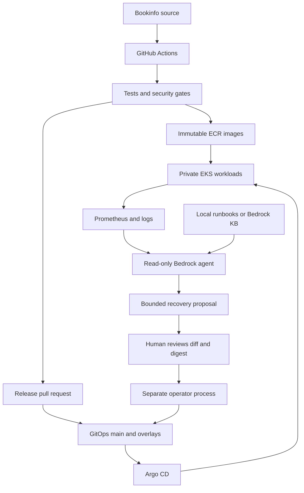

# Architecture & trust boundaries

AI has no execution tool and no Git push credential. Tool arguments cannot choose namespaces, arbitrary URLs, PromQL, shell commands or Kubernetes resource kinds.
The model can be wrong or receive injected log content. Deterministic policy constrains the change; human review remains required. Redaction is best-effort, not guaranteed DLP.

The approval digest binds the proposal, base Git SHA, environment, action and parameters; expires in 15 minutes. The executor refuses a dirty tree, changed HEAD, mixed rollback commit, unknown action or replicas outside 1..4. It can only write `gitops/overlays/<env>/release.yaml` targeting `productpage-v1`.
A local administrator can bypass these scripts; this is a learning boundary, not an authenticated multi-user approval service. Use a protected branch, required PR reviewers and an independent operator identity in a real organization.

Availability and cost: two AZs, private nodes, optional one NAT lab trade-off; production example selects two NATs. Workload replicas default to one for cost, not HA. Single-replica databases and Vault are optional learning labs, not HA production services.
